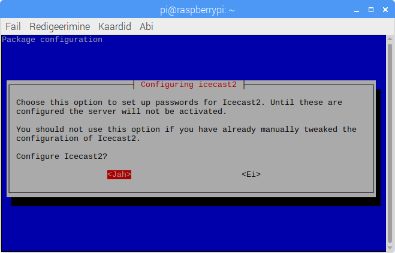
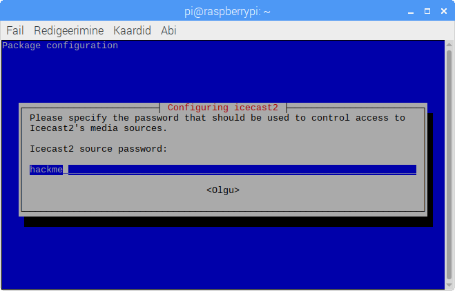

# Vabavaraline ringhääling veebis
Hetkel saab skriptidega paigaldada veebiraadiot. Kasutajal palutakse sisestada vaid hädavajalik info. Muu protsess on automatiseeritud.

## Mis on protsessi tulemuseks?
Olles teinud läbi paigalduse, on sul olemas kõik vajalik omanenda veebiraadio tegevusega alustamiseks.

## Mida mul vaja on?
Sisuliselt on selleks vaja serveri riistvara, USB helipulti koos mikrofonidega ja juhtmega internetiühendust.

Võimalik, et vaja läheb ka mõne arvutitega kodus oleva inimese abi. Seda eriti juhul, kui tahate raadiot kasutusele võtta kohas kus on keerulisem sisevõrk, või kui tahate raadio otse internetist (mitte vaid sisevõrgust) kuulatavaks teha.

## Ettevalmistused
Esiteks tuleks välja mõelda mis saab olema teie raadio nimi. Seda küsitakse tarkvara paigaldamise käigus.

Vaikimisi on raadio nimeks *"Meie oma raadio"*, ning välja saab sealt vahetada fraasi *Meie oma*. Sõna *raadio* vaikimisi välja vahetada ei saa. Erinimevajadustega kasutajatel on raadio nime pärast paigaldust lihtne HTML'is muuta.

Lisaks tuleks otsustada, kas tahate kuulata raadiot üksnes kohalikus võrgus, või teha selle kättesaadavaks ka internetis. Viimasest võimalusest räägime allpool lähemalt.

Kohalikku arvutispetsialisti võiks pärast raadioteemalist vestlust kostitada järgmiste küsimustega:
- *"Kuidas saada raadioruumi juhtmega võrguühendus?"*
- *"Vajalik on üles seada staatiline IP. Millises vahemikus ma seda teha võin?"*
- *"Kas meie kohalikus võrgus on VLANid või muud piirangud? Seade peaks olema võimalikult paljudele kättesaadav."*

## Uppusin praegu tehnilistesse mõistetesse!
Ei maksa lasta end hirmutada. Ülejäänud juhend põhineb Raspberry Pi'l mis on mõeldud vanusele alates 8. eluaastast. Kui Pi on tööle saadud, läheb veebiringhäälingu töökorda seadmiseks (sõltuvalt interneti kiirusest) umbes veerand tundi. Lisaks siis vajadusel kohaliku arvutispetsialisti lisaseadistused staatilise IP ning avalikust veebist kättesaadavaks tegemise osas.

## Soovitatav riistvara
- Raspberry Pi 3
- Vähemalt 32GB class 10 microSD kaart
- microSD kaardi lugeja
- Kuvar, klaviatuur, hiir
- USB helipult (vähemalt kaks eraldi valjususe reguleerimisega sisendit)
- Mikrofon(id)
- Helifailide taaesitamise seade (arvuti, nutifon)

Korraks on vaja ka ligipääsu Linux, macOS või Windows arvutile, et vormindada microSD kaart ning laadida sellele Raspbian operatsioonisüsteem. Luba arvutisse tarkvara paigaldada teeb protsessi lihtsamaks, aga see pole ilmtingimata vajalik.

MicroSD kaardi mahu valikul peaks võtma arvesse kui palju on omaloodud saateid salvestada. 

## Kas kindlasti just need seadmed?
Katsetamiseks sobib ka Raspberry Pi komplektiga kaasa tulnud 8GB NOOBS kaart, kuid sellel saab ruum kohe otsa. Raspberry Pi oli virtuaalse koormustesti andmetel võimeline raadiot edastama vähemalt tuhandele kuulajale. Samas jäi riistvara nõrgaks YouTube failide teisendamisel, mille ajal esines eetris heli nn "hakkimine".

Tegelikult võib raadio isegi paigaldada mõnda (vanemasse) arvutisse, mispuhul sõltuvalt protsessori jõudluse kasvust võrreldes Pi'ga peaks lahenema helifailide teisendamise ajal esinenud hakkimine. Raadiot on samuti võimalik paigaldada virtuaalmasinasse, kuid sel juhul on mikrofonide ühendamine keerulisem. Vanemat arvutit kasutusele võttes on kindlasti soovitav töökindluse suurendamiseks vana kõvaketta asemel panna arvutisse kaasaegne SSD. Tavaarvutis on soovitatav Raspbiani asemel kasutada operatsioonisüsteemi Debian.

# Riistvara paigaldusjuhend
- Komplekteeri Raspberry Pi
- Ühenda kuvar, klaviatuur, hiir
- Pane microSD kaart lugejasse ning ühenda see arvutiga

## Kui sul on luba tarkvara paigaldada
- Paigalda programmid [Etcher](https://www.balena.io/etcher/) ja [QuickHash GUI](https://quickhash-gui.org/downloads/)
- Tõmba alla [Raspbian with Desktop](https://www.raspberrypi.org/downloads/raspbian/)
- Ava QuickHash GUI veendumaks, et tõmmatud Raspbian on terviklik 
  - Vali alamenüü *File*
  - Vali algoritmiks *SHA-256*
  - Kleebi välja *Excpected Hash Value* Raspbiani allalaadimiste lehelt saadud SHA-256 räsi
  - Vali *Select File* abil Raspbiani .zip fail
  - Kui saad teate, et räsid klappisid, oled veendunud tõmmatud faili tervikluses ja võid selle lahti pakkida
- Ava Etcher, et vormindada microSD kaart
  - Vali Raspbiani .img fail
  - Vali sisestatud SD kaart
  - Vajuta *Flash!*
- Kui kõik valmis, eemalda microSD kaart lugejast ja sisesta Pi'sse.

## Kui sul pole luba tarkvara paigaldada
- Tõmba alla [NOOBS](https://www.raspberrypi.org/downloads/noobs/)
- QuickHash GUI käivitub ka ilma paigaldamata, seega on tervikluse kontroll sama mis eelmises punktis
- 

# Tarkvara paigaldusjuhised
Raspberry Pi puhul trüki terminali:
```bash
sudo -i
git clone https://github.com/hpaves/veebiringhaaling.git
cd veebiringhaaling
bash paigalda_raadio.sh pi
```

Debiani juhend, kui tavakasutaja nimi on dj:
```bash
su
cd
apt update && apt install git -y
git clone https://github.com/hpaves/veebiringhaaling.git
cd veebiringhaaling
bash paigalda_raadio.sh dj
```
## Paigalduse käigus tehtavad valikud.
Paigaldusskript annab kasutajale mitmeid valikuid. Kõik tehtavad valikud on olulised, kuid siinkohal on toodud välja mõned, millele tuleks pöörata erilist tähelepanu.

Icecast2 on vaja seadistada. Siin tuleb valida "jah", sest muidu läheb paigaldusega tõenäoliselt kauem kui lubatud veerand tundi.



Vaikimisi pakutud nimi `localhost` sobib.


Vaikimisi pakutud paroolid tuleb kindlasti muuta!



Järgi ekraanile tekkivaid edasisi juhiseid.

Kui arvuti küsib taaskäivitamist, tuleb sellega nõustuda.

Olles arvuti taaskäivitanud, on raadioteenus kohalikus võrgus (näiteks koolimaja wifis) kohe kuulatav.

### Olen erinimevajadusega
Trüki terminali:
```bash
sudo -i
gedit /var/www/html/index.php
```
Raadio nimi on kahel eraldi real. Seda pole raske leida ja muuta.
Ära üleliigset kustuta. Siis võib taas minna kauem kui veerand tundi.

# Paigaldusjärgsed tegevused
## Staatiline IP
Tõenäoliselt saab voogedastusserver esialgu dünaamilise IP mis võib aja jooksul muutuda. Seega tuleb esmajärjekorras tuleb seadmele määrata DHCP vahemikust välja jääv staatiline IP. Ära häbene selles osas oma arvutispetsialistilt abi küsida.

## Raadio avamine välisvõrgule
Siin kohal on keeruline anda täpseid juhiseid, kuna palju sõltub kohaliku võrgulahenduse spetsiifikas ja kooli enda soovitud lahendusest. Järgnevalt mõned suunavad küsimused kohaliku arvutispetsialistiga suhtlemiseks:
- *"Peame otsustama kas integreerida raadio kooli kodulehele, kasutada veebiserveriks raadioserverit ennast, või kaaluda muid variante. Mis oleks meie kooli puhulk mõistlik?"*
- *"Internetist kuulamiseks on vaja avada/suunata teatud pordid. Helivoog kasutab vaikimisi porti 8000. Kas saame seda ise teha, või peame pöörduma teenusepakkuja poole?"*
- *"Kas sa aitaksid mind selle kõigega?"*

## SSH
SSH teenus on nii Raspbianis kui Debianis vaikimisi välja lülitatud. Kui panere serveri avalikku veebi, siis ei tohiks SSH teenust sisse lülitada, või vähemalt tuleks ära keelata parooliga sisse logimise võimalus. Vajadusel saab sisse logida ka SSH võtmega.

# Süsteemis orienteerumine
Paigaldusjärgselt tekib kasutaja kodukausta kaust "raadio", millel on vaikimisi järgmine sisu: 

```
├── raadio
│   ├── avalik
│   │   ├── jarelkuulamine -> /var/www/html/jarelkuulamine
│   │   ├── muusika
│   │   ├── muusika.m3u
│   │   ├── teated
│   │   ├── teated.m3u
│   │   └── vaikimisi.ogg
│   ├── esitusloendid.txt
│   ├── salvestused
│   ├── v2rskenda_esitusloendeid.sh
│   └── youtube_allalaadimiste_arhiiv.txt
├── serveri_andmed.txt
```

## Kaustade ja failide funktsionaalsuse seletus

**├── raadio** (raadiofailide põhiline kaust)

**│   ├── avalik** (selle kausta sisu läheb ühel või teisel moel eetrisse)

**│   │   ├── jarelkuulamine** (siia kausta tuleb käsitsi lisada mp3 formaadis järekuulamise saated)

**│   │   ├── muusika** (siia kausta lisanduvad automaatselt esitusloendid.txt faili lisatud YouTube helifailid)

**│   │   ├── muusika.m3u** ('muusika' kausta esitusloend, genereeritakse automaatselt)

**│   │   ├── teated** (siia kausta tuleb käsitsi lisada reklaamid või teated, mida aeg-ajalt lugude vahel välja hõigata)

**│   │   ├── teated.m3u** ('teated' kausta esitusloend, genereeritakse automaatselt)

**│   │   └── vaikimisi.ogg** (vaikimisi helifail; mängitakse juhul, kui esitusloendid pole mingil põhjusel valmis)

**│   ├── esitusloendid.txt** (tekstifail kuhu tuleb lisada YouTube viited või esituloendid, mis kord päevas automaatselt alla tõmmatakse)

**│   ├── salvestused** (siia salvestuvad kõik Butt meediavood; sisuliselt otsesaadete salvestuspaik)

**│   ├── v2rskenda_esitusloendeid.sh** (hoiab esitusloendid ajakohasena, käivitub kord päevas automaatselt)

**│   └── youtube_allalaadimiste_arhiiv.txt** (YouTube'st alla tõmmatud failide nimistu)

**├── serveri_andmed.txt** (voogedastusserveri andmed; sõltuvalt seadistamisel tehtud valikutest ei pruugi seda faili eksisteerida)


# Kasutatud materjalid
### [HackerThemes theme-machine](https://github.com/HackerThemes/theme-machine)
Kasutajate veebiliidese kujundus.

### [aerth striss](https://github.com/aerth/striss)
Icecast koormustest.
